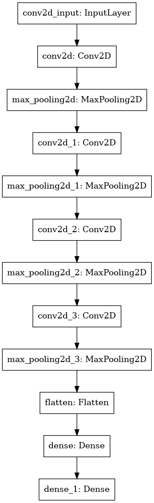

# Simple Captcha Solver

This project is about an automatical solver of captchas, designed to break captchas from a certain challenge website. It turned out to be very efficient (yet very over-complicated) to use Deep Learning techniques.

This is the first project I created using Machine Learning techniques.

## Solving process

1. Download the captcha. The standard size for this particular example was 120x40. Captchas look like the following one:

2. Preprocess the images:
    1. Convert the image into its binary representation (which means turning all pixels to either black or white). This makes further processing way easier with an acceptable loss of information.
    2. Divide the captcha into the single letters that compose it. Considered captchas had 6 letters. This was done using the [snake](https://www.acsac.org/2007/papers/70.pdf) technique. 
    3. Normalized obtained letters into a 32x32 pixels format in which letters are centered. This consistent format makes the Neural Network perform way better.
3. Feed groups of letters into the trained Neural Network.
4. Solved!

## Neural Network Architecture

The following image is a representation of the Neural Network that was used. 
This architecture was designed for a wider range of possible letters but it works pretty good on smaller ranges too.

  

Training was done in the standard manner, which is using annotated data. The dataset was retrived by using the `src/ocr/labeller.py` script, which makes the process really fast. It took about 30-40 minutes to gain a solid amount of annotated letters (~ 1200).

## Performances

The training of the Neural Network takes a very small amount of time (~5 minutes with a 2.6 GHz Intel i5-7x CPU only).

It takes it about 10 seconds to solve 50 captchas, including download and preprocessing.

On average, the trained Neural Network achieved a mean success rate of ~94%, peaking at 98%. Considering the amount of annotated data, I consider this a great result.
